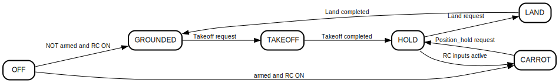

# UAV ROS Control 

| Ubuntu 18.04  | Ubuntu 20.04|
|---------------------------------------------------------------------------------------------------------------------------------|--------------------------------------------------------------------------------------------------------------------------------|
 [](https://github.com/lmark1/uav_ros_control/actions) | [](https://github.com/lmark1/uav_ros_control/actions) |

## Summary

The main control package of the [uav_ros_stack](https://github.com/lmark1/uav_ros_stack).  

It contains UAV control algorithms suitable for use with Ardupilot or PX4 platforms. 

## Node description

Both nodes are started with default configurations as follows:
```bash
export UAV_NAMESPACE=red; roslaunch uav_ros_control pid_carrot.launch
```

Argument **control_type** denotes the control program used:
* pid_cascade_node - Ardupilot compatible control using roll-pitch-yaw-thrust commands
* pid_cascade_node_yawrate - Ardupilot compatible control using roll-pitch-yawrate-thrust commands
* pid_cascade_node_px4 - PX4 compatible control using roll-pitch-yaw-thrust commands
* pid_cascade_node_px4_yawrate - PX4 compatible control using roll-pitch-yawrate-thrust commands

### PositionControlNode
An implementation of a cascade PID UAV control scheme  
* Subscribed topic **odometry** 
  * ```nav_msgs::Odometry```
  * current UAV estimated odometry
* Subscribed topic **uav/trajectory_point** 
  * ```trajectory_msgs::MultiDOFJointTrajectoryPoint``` 
  * current UAV referent trajectory point
* Published topic **uav/attitude_target**
  * ```mavros_msgs::AttitudeTarget```
  * calculated UAV attitude and thrust target

### CarrotReferenceNode

Used for publishing trajectory setpoints either through RC control or published topic  
* Parameters **carrot_index** and **carrot_enable**
  * Specify joy button that enables RC UAV control
* Service **takeoff**
  * ```uav_ros_msgs::Takeoff```
  * UAV takes off to the desired height
* Service **land**
  * ```std_srvs::SetBool```
  * UAV lands at the current position
* Service **position_hold**
  * ```std_srvs::Empty```
  * When called UAV listens to commands from topic **position_hold/trajectory**
  * If **joy** topic receives any inputs UAV exits position hold and listens to RC inputs
* Subscribed topic **joy**
  * ```sensor_msgs::Joy```
  * Controls the UAV if button at **carrot_index** is pressed
* Subscribed topic **odometry** 
  * ```nav_msgs::Odometry```
  * current UAV estimated odometry
* Subscribed topic **position_hold/trajectory** 
  * ```trajectory_msgs::MultiDOFJointTrajectoryPoint``` 
  * External UAV referent trajectory points
  * Relevant when UAV is in position hold
* Published topic **carrot/trajectory** 
  * ```trajectory_msgs::MultiDOFJointTrajectoryPoint``` 
  * current UAV referent trajectory point

#### State machine diagram

<div style="text-align:center">
  
</div>

State machine diagram is obtained using [smcat](https://github.com/sverweij/state-machine-cat) via the command:
```bash
smcat --direction left-right --engine circo carrot_state_machine.smcat
```

Modes available in the CarrotReferenceNode are as follows:
* OFF - RC trigger (determined by **carrot_index** and **carrot_enable** parameters) is turned off
* GROUNDED - UAV is ond the ground, ready to takeoff
* CARROT - UAV is flying in ```carrot-on-a-stick``` mode, controlled via RC commands
* HOLD - UAV is holding position and awaiting ```position_hold/trajectory``` commands
* TAKEOFF - UAV is in the process of taking off
* LAND - UAV is in the process of landing